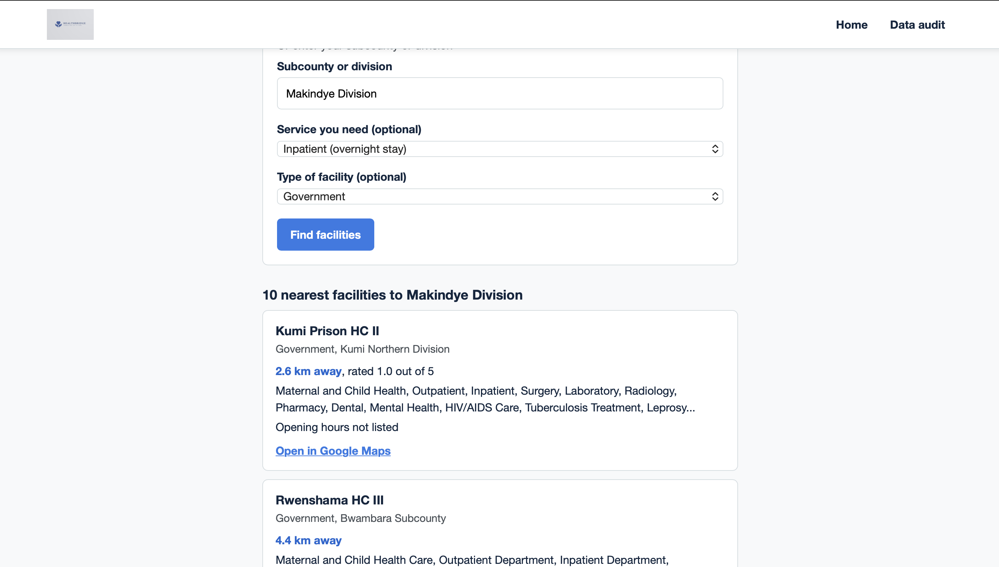
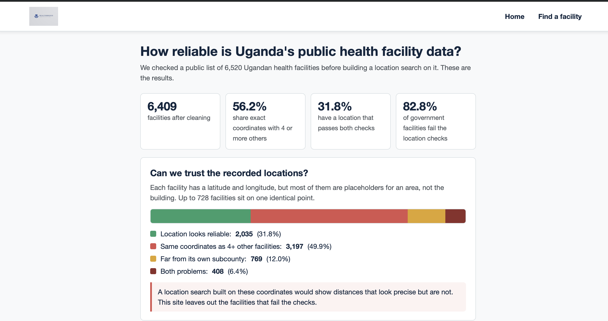

# HealthBridge Facility Finder (Uganda)

A web tool that finds the nearest health facilities in Uganda, built after auditing the public dataset behind it. The audit is the main result: more than half of the records have placeholder coordinates, and removing them would drop most government facilities.

**Live demo:** https://healthbridge-uganda.onrender.com (free hosting, so the first visit after a quiet period can take up to a minute to load)
**Data audit page:** https://healthbridge-uganda.onrender.com/visualization

> **Research prototype, not for emergencies.** The data is unverified and may be out of date. Call a facility before you travel.




## What it does

- Finds the 10 nearest facilities to your phone's location or to a subcounty you type.
- Filters by service (maternity, laboratory, pharmacy, X-ray and others) and by type of facility (government, private for-profit, private not-for-profit).
- Shows distance, services, opening hours, phone number and rating where the data has them, with a Google Maps link.
- Includes a data audit page that reports how reliable the underlying data is.

## What the audit found

| Finding | Result |
|---|---|
| Records in the raw dataset | 6,520 |
| Records after cleaning | 6,409 (51 exact duplicates, 57 same name and location, 3 outside Uganda) |
| Share exact coordinates with 4 or more other facilities | 3,605 (56.2%), up to 728 facilities on one point |
| More than 50 km from their own subcounty | 1,177 (18.4%) |
| Pass both location checks | 2,035 (31.8%) |
| Government facilities failing the checks | 82.8%, against 55.5% of other facilities |
| Government share of the data, before and after removing unreliable locations | 46.6% falls to 25.2% |
| No opening hours | 33.4% |
| No rating, phone, website | 33.0%, 29.0%, 77.2% |
| Payment method field | The same value ("cash") for every facility, so it is not used |

Removing unreliable locations is not neutral. A tool built only on the rows that pass would underrepresent public facilities, which are the ones many people rely on. That is why the site says so openly and the audit page shows the numbers.

## Why there is no machine-learning model

An earlier version of this project trained a neural network to predict a Low, Medium or High rating for each facility. I dropped it for two reasons. The location data it depended on turned out to be unreliable, and its test accuracy was measured after oversampling the data and before splitting it, which inflates the result. A search tool that is honest about its data is more useful than a model that looks accurate.

## How it works

1. **Cleaning** (`clean_data.ipynb`): repairs corrupted characters in opening hours, treats placeholder text such as "N/A" as missing, removes duplicates and points outside Uganda, and standardises the care-system labels.
2. **Location checks**: a point counts as a placeholder if 5 or more facilities share exactly the same coordinates, and as contradictory if it is more than 50 km from the middle of its own subcounty (checked only for subcounties with at least 3 facilities).
3. **Search** (`src/finder.py`): ranks the remaining facilities by haversine distance. Services in the data are free text with many spellings, so each service in the form searches for several keywords.
4. **Web app** (`src/app.py`): a Flask app with the finder and the audit page. Searches use POST, so locations never appear in URLs, and nothing is stored.

## Data source and disclaimer

The data is the [Uganda HealthCare Facilities dataset](https://huggingface.co/datasets/Pollicy/Uganda_HealthCare_Facilities) published by Pollicy, created by Rashid Kisejjere. According to its description, it combines an older Ministry of Health list with details collected from Google Maps and facility websites. Its creators state that it is intended for research, has not been verified, and may be out of date. This project is a research prototype and should not be used for medical decisions.

## Run it locally

```bash
git clone https://github.com/Skaveza/healthbridge-facility-finder.git
cd healthbridge-facility-finder
python3 -m venv venv
source venv/bin/activate
pip install -r requirements.txt
cd src
python app.py
```

Then open http://127.0.0.1:5000.

## Reproduce the audit

1. Download the dataset's CSV from Hugging Face and save it as `data/raw_facilities.csv`.
2. Run `clean_data.ipynb` from top to bottom. It prints the audit numbers and writes `data/facilities.csv`.
3. If the four counts at the top of the cleaning output change, update the `CLEANING` line in `src/finder.py`.

## Project structure

```
data/facilities.csv        cleaned data used by the app
clean_data.ipynb           cleaning and audit
src/app.py                 Flask routes
src/finder.py              distance search and audit numbers
src/templates/             pages (home, finder, audit, shared header)
src/static/                logo and images
requirements.txt
```

## Limitations

- Only 2,035 of the 6,409 cleaned facilities have a location I trust, and they lean towards private clinics.
- The Uganda boundary check is a rough box, so a point just across a border could slip through.
- Services are matched by keyword, so unusual spellings can be missed.
- Opening hours are shown as text. There is no "open now" filter.
- The data is a snapshot and does not update.

## Author

Sifa Kaveza Mwachoni

## Licence

Code released under the MIT Licence (see LICENSE). The dataset keeps its original terms; see its page on Hugging Face.